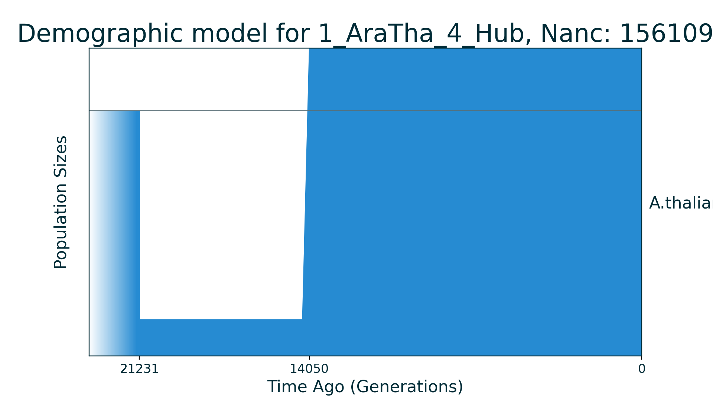
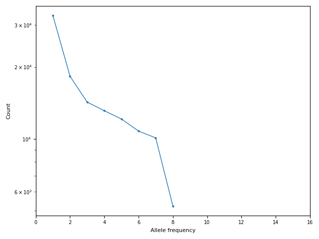

## 1_AraTha_4_Hub

| Number of populations | Number of parameters | Max log likelihood | Size of spectrum |
| --- | --- | --- | --- |
| 1 | 4 | -72.574 | 16 |

### Model Description

Three epoch model from Huber et al., 2018. First epoch is ancestral.

### Plots

Schematic model plot:

Simulated allele frequency spectrum:

### Optimal parameter values

| Parameter | Value | Description |
| --- | --- | --- |
| `N1` | 0.149 | Size of population during second epoch. |
| `T1` | 0.023 | Time of second epoch. |
| `N2` | 1.256 | Size of population during third epoch. |
| `T2` | 0.045 | Time of third epoch. |

