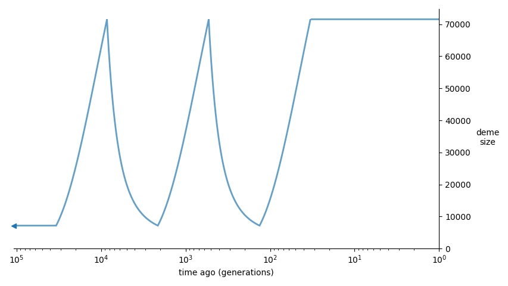

## 1_ZigZag_11_Sim

| Number of populations | Number of parameters | Max log likelihood | Size of spectrum |
| --- | --- | --- | --- |
| 1 | 11 | -62.375 | 20 |

### Model Description

ZigZag model from Stephan and Durbin, 2014.

### Plots

Schematic model plot:

Simulated allele frequency spectrum:

### Optimal parameter values

| Parameter | Value | Description |
| --- | --- | --- |
| `nu1` | 0.100 | Size of population after first exponential growth. |
| `nu2` | 1.000 | Size of population after first exponential decrease. |
| `nu3` | 0.100 | Size of population after second exponential growth. |
| `nu4` | 1.000 | Size of population after second exponential decrease. |
| `nu5` | 0.100 | Size of population now after third exp. growth. |
| `t1` | 1.789 | Time of first exponential growth. |
| `t2` | 0.447 | Time of first exponential decrease. |
| `t3` | 0.112 | Time of second exponential growth. |
| `t4` | 0.028 | Time of second exponential decrease. |
| `t5` | 0.007 | Time of third exponential growth. |
| `t6` | 0.002 | Time of end of the last growth. |

