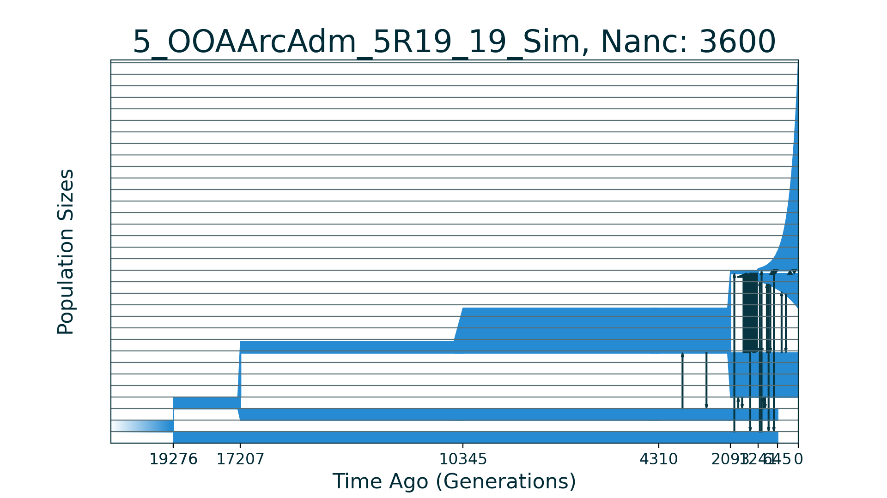
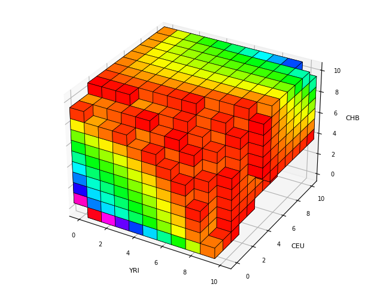
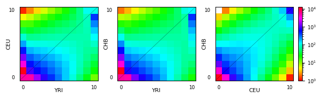

## 5_OOAArcAdm_5R19_19_Sim

| Number of populations | Number of parameters | Max log likelihood | Size of spectrum |
| --- | --- | --- | --- |
| 5 | 19 | -2227.756 | 10x10x10x10x10 |

### Model Description

Demographic history of five populations from Ragsdale and Gravel 2019.

This model is part of the stdpopsim models for Homo Sapiens.
See more information (OutOfAfricaArchaicAdmixture_5R19 model):
https://popsim-consortium.github.io/stdpopsim-docs/stable/catalog.html

The code is based on the examples of dadi for CUDA:
https://bitbucket.org/gutenkunstlab/dadi/src/master/examples/CUDA/models_moments.py

The model describes the splits of neandertalian and archaic african populations from ancestral population. Then the history of this population corresponds to the usual Out-of-Africa three population history. At the end two archaic populations are removed and final spectrum is three dimentional.

### Plots

Schematic model plot:

Simulated allele frequency spectrum:

Simulated allele frequency spectrum (projections):

### Optimal parameter values

| Parameter | Value | Description |
| --- | --- | --- |
| `nu_YRI` | 3.861 | The African population size after sudden growth and size of YRI population. |
| `nu_B` | 0.244 |  The bottleneck size of CEU+CHB common population.|
| `nu_CEU0` | 0.639 |  The bottleneck size for CEU population. |
| `nu_CEU` | 3.015 | The final size of CEU population after exponential growth. |
| `nu_CHB0` | 0.181 | The bottleneck size for CHB population. |
| `nuCHB` | 18. 287| The final size of CHB population after exponential growth. |
| `m_AF_B` | 3.758 | The scaled symmetric migration rate between YRI and CEU+CHB populations. |
| `m_YRI_CEU` | 0.179 | The scaled symmetric migration rate between YRI and CEU populations
| `m_YRI_CHB` | 0.000 | The scaled symmetric migration rate between YRI and CHB populations. |
| `m_CEU_CHB` | 0.814 | The scaled symmetric migration rate between CEU and CHB populations. |
| `m_AF_arch_af` | 0.143 | The scaled symmetric migration rate between YRI and archaic African populations that begins after sudden growth of YRI population. |
| `m_OOA_nean` | 0.059 | The scaled symmetric migration rate between Out of AFrica populations and neanderthalian population. |
| `T_Nean_arch_AF` | 0.287 | The time between neanderthalian split and archaic african population split. |
| `T_AF_arch_AF` | 0.953 | The time between archaic african population split and sudden growth of YRI population. |
| `T_AF_no_arch_mig` | 0.838 | The time between YRI sudden population growth and start of admixture from archaic african population. |
| `T_AF_arch_mig` | 0.308 | The time between start of admixture from archaic african population and OOA event. |
| `T_Bot` | 0.118 | The time between the OOA event and Eurasian population split. Time of CEU+CHB population existence. |
| `T_EU_AS_arch_adm_end` | 0.083 | The time between Eurasian population split and before end of archaic admixture. |
| `T_EU_AS_no_arch_adm` | 0.090 | The time between end of archaic admixture and present. |