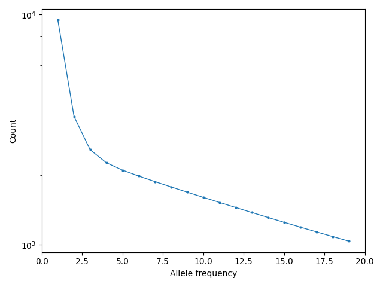
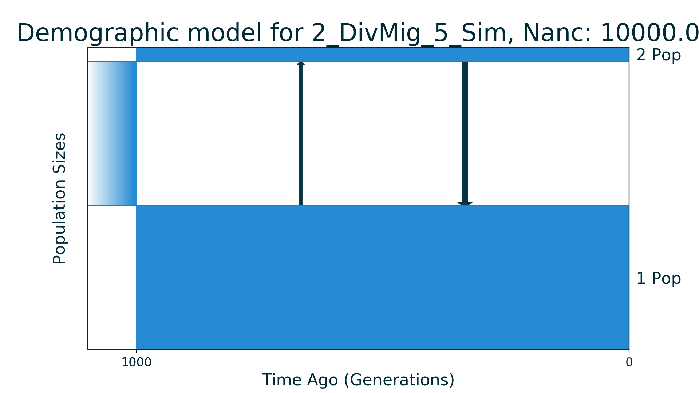
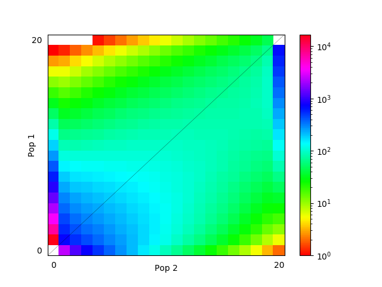
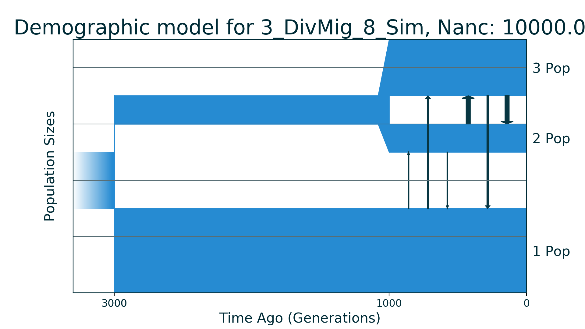
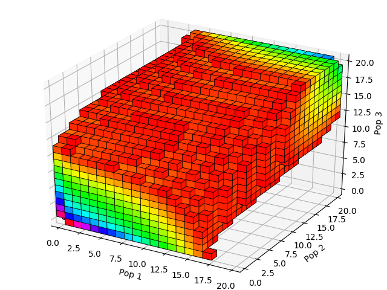
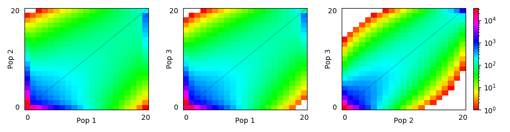
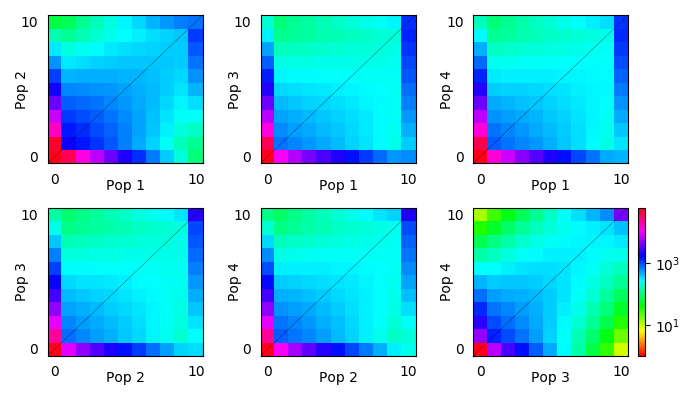

# Data for demographic inference

This repo contains AFS data (simulated and real) for different kinds of
demographic inference, for example, it could be used for some algorithm
benchmark and so on.

Right now everything is for the python package
[moments](https://bitbucket.org/simongravel/moments/src/master).

## Structure of data folders

### Name of folder

All data is located in its folder each of which has special name:

`{N}_{Descr}_{M}_{Origin}`

where `N` is the **number of populations**, `Descr` stands for **simple
description** of the demographic model, `M` is the **number of parameters**
in model and `Origin` is three letters of data origin. For example:

`2_DivMig_5_Sim` means AFS data for 2 populations that was simulated (`Sim`)
under the demographic history with divergence and migration that has in total
5 parameters.

For real data `Origin` contains the first three letters of the first author of the
corresponding paper. For example:

`2_YRI_CEU_6_Gut` means AFS data and demographic model for YRI and CEU
populations from the **Gut**enkunst et al., 2009 paper.

### Folder structure

Each directory contains several files:

* demographic_model.py - file with demographic model code. Code is written
for [moments](https://bitbucket.org/simongravel/moments/src/master).

* `main_script.py` - script with all information about AFS data. If data is
simulated then during script run it will be saved to `fs_data.fs`.

* `fs_data.fs` - AFS data in fs dadi format.

* `model_plot.png` - schematic plot of the demographic model.

* `fs_plot.png` or `fs_plot_projections.png` - plots of AFS.

File `main.py` is a valid file with python code and contains following
information about data:

| Variable | Description |
| --- | --- |
| `n_pop` | Number of populations |
| `par_labels` | Labels of model parameters |
| `popt` | Optimal values parameters |
| `Nanc` | Size of ancestral population |
| `lower_bound` | Lower bound for parameters |
| `upper_bound` | Upper bound for parameters |
| `ns` | Sample sizes of AFS |

### Units

Note that all parameters values are in genetic units (relative to size
`Nanc` of ancestral population). Size of populations are relative to `Nanc`,
time is in `2 * Nanc` generations abd migrations are in `1 / (2 * Nanc)`
units. For more information see [moments manual](https://bitbucket.org/
simongravel/moments/src/master/doc/manual/manual.pdf) section `5.2 Units`.

# Simulated data

## 1_Bot_4_Sim

| Number of populations | Number of parameters | Size of spectrum |
| --- | --- | --- |
| 1 | 4 | 20 |

### Model Description

Classical one population bottleneck model.
### Plots

Schematic model plot:

Simulated allele frequency spectrum:

### Optimal parameter values

| Parameter | Value | Description |
| --- | --- | --- |
| `nuB` | 0.01 | Size of population during bottleneck. |
| `nuF` | 1.0 | Size of population now. |
| `tB` | 0.005 | Time of bottleneck duration. |
| `tF` | 0.05 | Time after bottleneck finished. |

## 2_DivMig_5_Sim

| Number of populations | Number of parameters | Size of spectrum |
| --- | --- | --- |
| 2 | 5 | 20x20 |

### Model Description

Simple two populations model. Ancestral population of constant size splits into two subpopulations of constant size with asymetrical migrations.
### Plots

Schematic model plot:

Simulated allele frequency spectrum:

### Optimal parameter values

| Parameter | Value | Description |
| --- | --- | --- |
| `nu1` | 1.0 | Size of subpopulation 1 after split. |
| `nu2` | 0.1 | Size of subpopulation 2 after split. |
| `m12` | 5 | Migration rate from subpopulation 2 to subpopulation 1. |
| `m21` | 2.5 | Migration rate from subpopulation 1 to subpopulation 2. |
| `T` | 0.05 | Time of split. |

## 3_DivMig_8_Sim

| Number of populations | Number of parameters | Size of spectrum |
| --- | --- | --- |
| 3 | 8 | 20x20x20 |

### Model Description

Three populations demographic history with small number of parameters. In the model ancestral population is split into population 1 and population 2, each of which had constant size till now days. Population 3 is formed by split from population 2 without change of its size and had constant size till now too. Migration rates are symmetrical.
### Plots

Schematic model plot:

Simulated allele frequency spectrum:

Simulated allele frequency spectrum (projections):

### Optimal parameter values

| Parameter | Value | Description |
| --- | --- | --- |
| `nu1` | 1.5 | Size of population 1. |
| `nu2` | 0.5 | Size of population 2. |
| `nu3` | 1.0 | Size of population 3 after split from population 2. |
| `m12` | 0.5 | Migration rate between population 1 and population 2. |
| `m13` | 1.0 | Migration rate between population 1 and population 3. |
| `m23` | 3.0 | Migration rate between population 2 and population 3. |
| `T1` | 0.1 | Time between ancestral population split and divergence of population 3 from population 2. |
| `T2` | 0.05 | Time of population 3 divergence from population 2. |

## 4_DivMig_11_Sim

| Number of populations | Number of parameters | Size of spectrum |
| --- | --- | --- |
| 4 | 11 | 10x10x10x10 |

### Model Description

Four population demographic history with 11 parameters. Ancestral population of constant size was split (T1 + T2 + T3) time ago into two new populations. First (1) population has constant size till nowdays. After divergence there was migration to population 1 from another population. The second formed population turned out to be a common population to another three populations: (T2 + T3) time ago it splits and formed so-called population 2 and T3 time ago the second formed population divided into population 3 and population 4. There were almost no migrations between populations except symmetric one between populations 3 and 4.
### Plots

Schematic model plot:

Simulated allele frequency spectrum (projections):

### Optimal parameter values

| Parameter | Value | Description |
| --- | --- | --- |
| `nu1` | 1.5 | Size of population 1 after split of ancestral population. |
| `nu234` | 0.8 | Size of common ancestor population of populations 2, 3 and 4 after split of ancestral population. |
| `nu2` | 1.0 | Size of population 2 after split of common ancestor population of populations 2, 3 and 4. |
| `nu34` | 0.5 | Size of common ancestor population of populations 3 and 4 after division of population 2 from their common ancestor population. |
| `nu3` | 0.2 | Size of population 3. |
| `nu4` | 0.3 | Size of population 4. |
| `m12_anc` | 2 | Migration rate to population 1 from common ancestor population of populations 2, 3 and 4. |
| `m34_sym` | 3 | Symmetric migration rate between populations 3 and 4. |
| `T1` | 0.1 | Time between ancestral population split, population 1 formation and next split. |
| `T2` | 0.15 | Time between ancestral population of populations 2, 3 and 4 split, population 2 formation and next split. |
| `T3` | 0.05 | Time of ancestral population of populations 3 and 4 split and formations of population 3 and population 4. |

