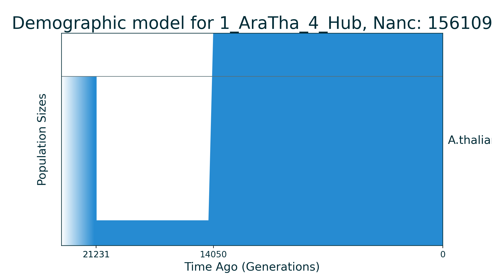

# Data for demographic inference

This repo contains AFS data (simulated and real) for different kinds of
demographic inference, for example, it could be used for some algorithm
benchmark and so on.

Right now simulations of the data were performed with the python package
[moments](https://bitbucket.org/simongravel/moments/src/master).

# API for optimization benchmarks

This repo contains package for Python3 for easy benchmark of optimization
algorithms. It is rather small package and one could take a look to files
in `deminf_data` folder. To install package run the following command from
base directory:

```console
$ python3 setup.py install
```

The example of usage could be found in jupyter notebook
[`API_example.ipynb`](https://github.com/noscode/demographic_inference_data/blob/master/API_example.ipynb)

## Dependencies
Among classical dependencies (e. g. numpy) the package depends on
[moments](https://bitbucket.org/simongravel/moments/src/master).

Moments could be installed from its repo:

```console
$ git clone https://bitbucket.org/simongravel/moments
$ cd moments
$ python3 setup.py install
```

# Available AFS data

- [Simulated data](#simulated-data)
	* [1_Bot_4_Sim](#1_Bot_4_Sim)
	* [1_ZigZag_11_Sim](#1_ZigZag_11_Sim)
	* [2_ExpDivNoMig_5_Sim](#2_ExpDivNoMig_5_Sim)
	* [2_DivMig_5_Sim](#2_DivMig_5_Sim)
	* [2_BotDivMig_8_Sim](#2_BotDivMig_8_Sim)
	* [3_DivMig_8_Sim](#3_DivMig_8_Sim)
	* [4_DivNoMig_9_Sim](#4_DivNoMig_9_Sim)
	* [4_DivMig_11_Sim](#4_DivMig_11_Sim)
	* [4_DivMig_18_Sim](#4_DivMig_18_Sim)
	* [5_DivNoMig_9_Sim](#5_DivNoMig_9_Sim)
	* [5_OOAArcAdm_5R19_19_Sim](#5_OOAArcAdm_5R19_19_Sim)
- [Real data](#real-data)
	* [1_AraTha_4_Hub](#1_AraTha_4_Hub)
	* [2_ButAllA_3_McC](#2_ButAllA_3_McC)
	* [2_ButSynB2_5_McC](#2_ButSynB2_5_McC)
	* [2_YRI_CEU_6_Gut](#2_YRI_CEU_6_Gut)
	* [3_YRI_CEU_CHB_13_Jou](#3_YRI_CEU_CHB_13_Jou)
	* [3_YRI_CEU_CHB_13_Gut](#3_YRI_CEU_CHB_13_Gut)
	* [4_YRI_CEU_CHB_JPT_17_Jou](#4_YRI_CEU_CHB_JPT_17_Jou)
	* [5_YRI_CEU_CHB_JPT_KHV_21_Jou](#5_YRI_CEU_CHB_JPT_KHV_21_Jou)


## Structure of data folders

### Name of folder

All data is located in its folder each of which has special name:

`{N}_{Descr}_{M}_{Origin}`

where `N` is the **number of populations**, `Descr` stands for **simple
description** of the demographic model, `M` is the **number of parameters**
in model and `Origin` is three letters of data origin. For example:

`2_DivMig_5_Sim` means AFS data for 2 populations that was simulated (`Sim`)
under the demographic history with divergence and migration that has in total
5 parameters.

For real data `Origin` contains the first three letters of the first author of the
corresponding paper. For example:

`2_YRI_CEU_6_Gut` means AFS data and demographic model for YRI and CEU
populations from the **Gut**enkunst et al., 2009 paper.

### Folder structure

Each directory contains several files:

* demographic_model.py - file with demographic model code. Code is written
for [moments](https://bitbucket.org/simongravel/moments/src/master).

* `main_script.py` - script with all information about AFS data. If data is
simulated then during script run it will be saved to `fs_data.fs`.

* `fs_data.fs` - AFS data in fs dadi format.

* `model_plot.png` - schematic plot of the demographic model.

* `fs_plot.png` or `fs_plot_projections.png` - plots of AFS.

File `main.py` is a valid file with python code and contains following
information about data:

| Variable | Description |
| --- | --- |
| `n_pop` | Number of populations |
| `par_labels` | Labels of model parameters |
| `max_ll` | Maximum log composite likelihood |
| `popt` | Optimal values parameters |
| `Nanc` | Size of ancestral population |
| `lower_bound` | Lower bound for parameters |
| `upper_bound` | Upper bound for parameters |
| `ns` | Sample sizes of AFS |

### Units

Note that all parameters values are in genetic units (relative to size
`Nanc` of ancestral population). Size of populations are relative to `Nanc`,
time is in `2 * Nanc` generations abd migrations are in `1 / (2 * Nanc)`
units. For more information see [moments manual](https://bitbucket.org/
simongravel/moments/src/master/doc/manual/manual.pdf) section `5.2 Units`.

# Simulated data

## 1_Bot_4_Sim


| Number of populations | Number of parameters | Max log likelihood | Size of spectrum |
| --- | --- | --- | --- |
| 1 | 4 | -88.560 | 20 |


### Model Description

Classical one population bottleneck model.

### Plots

Schematic model plot:


Simulated allele frequency spectrum:


### Optimal parameter values

| Parameter | Value | Description |
| --- | --- | --- |
| `nuB` | 0.010 | Size of population during bottleneck. |
| `nuF` | 1.000 | Size of population now. |
| `tB` | 0.005 | Time of bottleneck duration. |
| `tF` | 0.050 | Time after bottleneck finished. |

## 1_ZigZag_11_Sim


| Number of populations | Number of parameters | Max log likelihood | Size of spectrum |
| --- | --- | --- | --- |
| 1 | 11 | -62.375 | 20 |


### Model Description

ZigZag model from Stephan and Durbin, 2014.

### Plots

Schematic model plot:


Simulated allele frequency spectrum:


### Optimal parameter values

| Parameter | Value | Description |
| --- | --- | --- |
| `nu1` | 0.100 | Size of population after first exponential growth. |
| `nu2` | 1.000 | Size of population after first exponential decrease. |
| `nu3` | 0.100 | Size of population after second exponential growth. |
| `nu4` | 1.000 | Size of population after second exponential decrease. |
| `nu5` | 0.100 | Size of population now after third exp. growth. |
| `t1` | 1.789 | Time of first exponential growth. |
| `t2` | 0.447 | Time of first exponential decrease. |
| `t3` | 0.112 | Time of second exponential growth. |
| `t4` | 0.028 | Time of second exponential decrease. |
| `t5` | 0.007 | Time of third exponential growth. |
| `t6` | 0.002 | Time of end of the last growth. |

## 2_ExpDivNoMig_5_Sim


| Number of populations | Number of parameters | Max log likelihood | Size of spectrum |
| --- | --- | --- | --- |
| 2 | 5 | -1503.119 | 20x20 |


### Model Description

Demographic model of isolation for two populations with exponential growth of an ancestral population followed by split.

### Plots

Schematic model plot:


Simulated allele frequency spectrum:


### Optimal parameter values

| Parameter | Value | Description |
| --- | --- | --- |
| `nu` | 5.000 | Size of ancestral population after exponential growth. |
| `nu1` | 2.000 | Size of population 1 after split. |
| `nu2` | 4.000 | Size of population 2 after split. |
| `T1` | 4.000 | Time between exponential growth of ancestral population and its split. |
| `T2` | 1.000 | Time of ancestral population split. |

## 2_DivMig_5_Sim


| Number of populations | Number of parameters | Max log likelihood | Size of spectrum |
| --- | --- | --- | --- |
| 2 | 5 | -1310.931 | 20x20 |


### Model Description

Simple two populations model. Ancestral population of constant size splits into two subpopulations of constant size with asymetrical migrations.

### Plots

Schematic model plot:


Simulated allele frequency spectrum:


### Optimal parameter values

| Parameter | Value | Description |
| --- | --- | --- |
| `nu1` | 1.000 | Size of subpopulation 1 after split. |
| `nu2` | 0.100 | Size of subpopulation 2 after split. |
| `m12` | 5.000 | Migration rate from subpopulation 2 to subpopulation 1. |
| `m21` | 2.500 | Migration rate from subpopulation 1 to subpopulation 2. |
| `T` | 0.050 | Time of split. |

## 2_BotDivMig_8_Sim


| Number of populations | Number of parameters | Max log likelihood | Size of spectrum |
| --- | --- | --- | --- |
| 2 | 8 | -1035.905 | 20x20 |


### Model Description

Demographic history of two populations with bottleneck of ancestral population followed by split and growth of both new formed populations exponentially and linearly correspondingly.

### Plots

Schematic model plot:


Simulated allele frequency spectrum:


### Optimal parameter values

| Parameter | Value | Description |
| --- | --- | --- |
| `nu` | 0.100 | Size of ancestral population after sudden decrease. |
| `f` | 0.300 | Fraction in which ancestral population splits. |
| `nu1` | 2.000 | Size of population 1 after exponential growth. |
| `nu2` | 3.000 | Size of population 2 after linear growth. |
| `m12` | 1.000 | Migration rate from subpopulation 2 to subpopulation 1. |
| `m21` | 0.100 | Migration rate from subpopulation 1 to subpopulation 2. |
| `T1` | 0.500 | Time between sudden growth of ancestral population and its split. |
| `T2` | 1.000 | Time of ancestral population split. |

## 3_DivMig_8_Sim


| Number of populations | Number of parameters | Max log likelihood | Size of spectrum |
| --- | --- | --- | --- |
| 3 | 8 | -11178.277 | 20x20x20 |


### Model Description

Three populations demographic history with small number of parameters. In the model ancestral population is split into population 1 and population 2, each of which had constant size till now days. Population 3 is formed by split from population 2 without change of its size and had constant size till now too. Migration rates are symmetrical.

### Plots

Schematic model plot:


Simulated allele frequency spectrum:


Simulated allele frequency spectrum (projections):


### Optimal parameter values

| Parameter | Value | Description |
| --- | --- | --- |
| `nu1` | 1.500 | Size of population 1. |
| `nu2` | 0.500 | Size of population 2. |
| `nu3` | 1.000 | Size of population 3 after split from population 2. |
| `m12` | 0.500 | Migration rate between population 1 and population 2. |
| `m13` | 1.000 | Migration rate between population 1 and population 3. |
| `m23` | 3.000 | Migration rate between population 2 and population 3. |
| `T1` | 0.100 | Time between ancestral population split and divergence of population 3 from population 2. |
| `T2` | 0.050 | Time of population 3 divergence from population 2. |

## 4_DivNoMig_9_Sim


| Number of populations | Number of parameters | Max log likelihood | Size of spectrum |
| --- | --- | --- | --- |
| 4 | 9 | -62609.681 | 20x20x20x20 |


### Model Description

Four population demographic history without migrations with 9 parameters. Ancestral population of constant size was split (T1 + T2 + T3) time ago into two new populations. First (1) population has constant size till nowdays. The second formed population turned out to be a common population to another three populations: (T2 + T3) time ago it splits and formed so-called population 2 and T3 time ago the second formed population divided into population 3 and population 4. No migrations between populations.

### Plots

Schematic model plot:


Simulated allele frequency spectrum (projections):


### Optimal parameter values

| Parameter | Value | Description |
| --- | --- | --- |
| `nu1` | 1.500 | Size of population 1 after split of ancestral population. |
| `nu234` | 0.800 | Size of common ancestor population of populations 2, 3 and 4 after split of ancestral population. |
| `nu2` | 1.000 | Size of population 2 after split of common ancestor population of populations 2, 3 and 4. |
| `nu34` | 0.500 | Size of common ancestor population of populations 3 and 4 after division of population 2 from their common ancestor population. |
| `nu3` | 0.200 | Size of population 3. |
| `nu4` | 0.300 | Size of population 4. |
| `T1` | 0.100 | Time between ancestral population split (population 1 formation) and next split. |
| `T2` | 0.150 | Time between ancestral population of populations 2, 3 and 4 split (population 2 formation) and next split. |
| `T3` | 0.050 | Time of ancestral population of populations 3 and 4 split which have led to formations of population 3 and population 4. |

## 4_DivMig_11_Sim


| Number of populations | Number of parameters | Max log likelihood | Size of spectrum |
| --- | --- | --- | --- |
| 4 | 11 | -16932.827 | 10x10x10x10 |


### Model Description

Four population demographic history with 11 parameters. Ancestral population of constant size was split (T1 + T2 + T3) time ago into two new populations. First (1) population has constant size till nowdays. After divergence there was migration to population 1 from another population. The second formed population turned out to be a common population to another three populations: (T2 + T3) time ago it splits and formed so-called population 2 and T3 time ago the second formed population divided into population 3 and population 4. There were almost no migrations between populations except symmetric one between populations 3 and 4.

### Plots

Schematic model plot:


Simulated allele frequency spectrum (projections):


### Optimal parameter values

| Parameter | Value | Description |
| --- | --- | --- |
| `nu1` | 1.500 | Size of population 1 after split of ancestral population. |
| `nu234` | 0.800 | Size of common ancestor population of populations 2, 3 and 4 after split of ancestral population. |
| `nu2` | 1.000 | Size of population 2 after split of common ancestor population of populations 2, 3 and 4. |
| `nu34` | 0.500 | Size of common ancestor population of populations 3 and 4 after division of population 2 from their common ancestor population. |
| `nu3` | 0.200 | Size of population 3. |
| `nu4` | 0.300 | Size of population 4. |
| `m12_anc` | 2.000 | Migration rate to population 1 from common ancestor population of populations 2, 3 and 4. |
| `m34_sym` | 3.000 | Symmetric migration rate between populations 3 and 4. |
| `T1` | 0.100 | Time between ancestral population split, population 1 formation and next split. |
| `T2` | 0.150 | Time between ancestral population of populations 2, 3 and 4 split, population 2 formation and next split. |
| `T3` | 0.050 | Time of ancestral population of populations 3 and 4 split and formations of population 3 and population 4. |

## 4_DivMig_18_Sim


| Number of populations | Number of parameters | Max log likelihood | Size of spectrum |
| --- | --- | --- | --- |
| 4 | 18 | -16452.849 | 10x10x10x10 |


### Model Description

Four population demographic history with 18 parameters. Ancestral population of constant size was split (T1 + T2 + T3) time ago into two new populations. First (1) population has constant size till nowdays. The second formed population turned out to be a common population to another three populations: (T2 + T3) time ago it splits and formed so-called population 2 and T3 time ago the second formed population divided into population 3 and population 4. All migrations between populations were symmetrical.

### Plots

Schematic model plot:


Simulated allele frequency spectrum (projections):


### Optimal parameter values

| Parameter | Value | Description |
| --- | --- | --- |
| `nu1` | 1.500 | Size of population 1 after split of ancestral population. |
| `nu234` | 0.800 | Size of common ancestor population of populations 2, 3 and 4 after split of ancestral population. |
| `nu2` | 1.000 | Size of population 2 after split of common ancestor population of populations 2, 3 and 4. |
| `nu34` | 0.500 | Size of common ancestor population of populations 3 and 4 after division of population 2 from their common ancestor population. |
| `nu3` | 0.200 | Size of population 3. |
| `nu4` | 0.300 | Size of population 4. |
| `m1_234` | 5.000 | Symmetric migration rate between population 1 and common ancestor population of 2, 3 and 4 populations (between first and second splits). |
| `m1_2` | 0.500 | Symmetric migration rate between population 1 and population 2 (between second and third splits). |
| `m1_34` | 1.000 | Symmetric migration rate between population 1 and common ancestor of population 3 and population 4 (between second and third splits). |
| `m2_34` | 3.000 | Symmetric migration rate between population 2 and common ancestor of population 3 and population 4 (between second and third splits). |
| `m1_3` | 0.400 | Symmetric migration rate between population 1 and population 3 (after the third split). |
| `m1_4` | 0.300 | Symmetric migration rate between population 1 and population 4 (after the third split). |
| `m2_3` | 1.200 | Symmetric migration rate between population 2 and population 3 (after the third split). |
| `m2_4` | 1.300 | Symmetric migration rate between population 2 and population 4 (after the third split). |
| `m3_4` | 2.000 | Symmetric migration rate between population 3 and population 4 (after the third split). |
| `T1` | 0.100 | Time between ancestral population split (population 1 formation) and next split. |
| `T2` | 0.150 | Time between ancestral population of populations 2, 3 and 4 split (population 2 formation) and next split. |
| `T3` | 0.050 | Time of ancestral population of populations 3 and 4 split which have led to formations of population 3 and population 4. |

## 5_DivNoMig_9_Sim


| Number of populations | Number of parameters | Max log likelihood | Size of spectrum |
| --- | --- | --- | --- |
| 5 | 9 | -55340.517 | 10x10x10x10x10 |


### Model Description

Simple demographic history of five populations without migrations. Model have 9 parameters. Each population number i has constant size of nui. Ancestral population splits (T1+T2+T3+T4) time ago to population 1 and 2. Then (T2+T3+T4) time ago population 2 splits into population 2 and 3. (T3 + T4) time ago population 3 split to populations 3 and 4. And finally T4 time ago population 4 split in populations 4 and 5.

### Plots

Schematic model plot:


Simulated allele frequency spectrum (projections):


### Optimal parameter values

| Parameter | Value | Description |
| --- | --- | --- |
| `nu1` | 1.000 | Size of population 1. |
| `nu2` | 2.000 | Size of population 2. |
| `nu3` | 1.500 | Size of population 3 after split from population 2. |
| `nu4` | 1.000 | Size of population 4 after split from population 3. |
| `nu5` | 0.500 | Size of population 5 after split from population 4. |
| `T1` | 0.050 | Time between ancestral population split and second split. |
| `T2` | 0.100 | Time between second and third splits. |
| `T3` | 0.150 | Time between third and fourth splits. |
| `T4` | 0.050 | Time of fourth split. |

## 5_OOAArcAdm_5R19_19_Sim


| Number of populations | Number of parameters | Max log likelihood | Size of spectrum |
| --- | --- | --- | --- |
| 5 | 19 | -2227.756 | 10x10x10x10x10 |


### Model Description

Demographic history of five populations from Ragsdale and Gravel 2019.

This model is part of the stdpopsim models for Homo Sapiens.
See more information (OutOfAfricaArchaicAdmixture_5R19 model):
https://popsim-consortium.github.io/stdpopsim-docs/stable/catalog.html

The code is based on the examples of dadi for CUDA:
https://bitbucket.org/gutenkunstlab/dadi/src/master/examples/CUDA/models_moments.py

The model describes the splits of neandertalian and archaic african populations from ancestral population. Then the history of this population corresponds to the usual Out-of-Africa three population history. At the end two archaic populations are removed and final spectrum is three dimentional.

### Plots

Schematic model plot:


Simulated allele frequency spectrum:


Simulated allele frequency spectrum (projections):


### Optimal parameter values

| Parameter | Value | Description |
| --- | --- | --- |
| `nu_YRI` | 3.861 | The African population size after sudden growth and size of YRI population. |
| `nu_B` | 0.244 |  The bottleneck size of CEU+CHB common population.|
| `nu_CEU0` | 0.639 |  The bottleneck size for CEU population. |
| `nu_CEU` | 3.015 | The final size of CEU population after exponential growth. |
| `nu_CHB0` | 0.181 | The bottleneck size for CHB population. |
| `nuCHB` | 18. 287| The final size of CHB population after exponential growth. |
| `m_AF_B` | 3.758 | The scaled symmetric migration rate between YRI and CEU+CHB populations. |
| `m_YRI_CEU` | 0.179 | The scaled symmetric migration rate between YRI and CEU populations
| `m_YRI_CHB` | 0.000 | The scaled symmetric migration rate between YRI and CHB populations. |
| `m_CEU_CHB` | 0.814 | The scaled symmetric migration rate between CEU and CHB populations. |
| `m_AF_arch_af` | 0.143 | The scaled symmetric migration rate between YRI and archaic African populations that begins after sudden growth of YRI population. |
| `m_OOA_nean` | 0.059 | The scaled symmetric migration rate between Out of AFrica populations and neanderthalian population. |
| `T_Nean_arch_AF` | 0.287 | The time between neanderthalian split and archaic african population split. |
| `T_AF_arch_AF` | 0.953 | The time between archaic african population split and sudden growth of YRI population. |
| `T_AF_no_arch_mig` | 0.838 | The time between YRI sudden population growth and start of admixture from archaic african population. |
| `T_AF_arch_mig` | 0.308 | The time between start of admixture from archaic african population and OOA event. |
| `T_Bot` | 0.118 | The time between the OOA event and Eurasian population split. Time of CEU+CHB population existence. |
| `T_EU_AS_arch_adm_end` | 0.083 | The time between Eurasian population split and before end of archaic admixture. |
| `T_EU_AS_no_arch_adm` | 0.090 | The time between end of archaic admixture and present. |

# Real data

## 1_AraTha_4_Hub


| Number of populations | Number of parameters | Max log likelihood | Size of spectrum |
| --- | --- | --- | --- |
| 1 | 4 | -72.574 | 16 |


### Model Description

Three epoch model from Huber et al., 2018. First epoch is ancestral.

### Plots

Schematic model plot:



Simulated allele frequency spectrum:


### Optimal parameter values

| Parameter | Value | Description |
| --- | --- | --- |
| `N1` | 0.149 | Size of population during second epoch. |
| `T1` | 0.023 | Time of second epoch. |
| `N2` | 1.256 | Size of population during third epoch. |
| `T2` | 0.045 | Time of third epoch. |

## 2_ButAllA_3_McC


| Number of populations | Number of parameters | Max log likelihood | Size of spectrum |
| --- | --- | --- | --- |
| 2 | 3 | -283.599 | 12x12 |


### Model Description

Demographic model without migration for two populations of butterflies. Data and model are from McCoy et al. 2013. Model is very simple: ancestral population splits into two new populations of constant size.

### Plots

Schematic model plot:


Simulated allele frequency spectrum:


### Optimal parameter values

| Parameter | Value | Description |
| --- | --- | --- |
| `nuW` | 1.320 | Size of first subpopulation. |
| `nuC` | 0.173 | Size of second subpopulation. |
| `T` | 0.117 | Time of ancestral population split. |

## 2_ButSynB2_5_McC


| Number of populations | Number of parameters | Max log likelihood | Size of spectrum |
| --- | --- | --- | --- |
| 2 | 5 | -210.769 | 12x12 |


### Model Description

Demographic model with asymmetric migrations for two populations of butterflies. Data and model are from McCoy et al. 2013. Ancestral population split into two new formed populations with following continuous migrations between them.

### Plots

Schematic model plot:


Simulated allele frequency spectrum:


### Optimal parameter values

| Parameter | Value | Description |
| --- | --- | --- |
| `nuW` | 0.873 | Size of first new formed population. |
| `nuC` | 0.121 | Size of second new formed population. |
| `T` | 0.080 | Time of ancestral population split. |
| `m12` | 0.923 | Migration rate from second population to first one. |
| `m21` | 0.000 | Migration rate from first population to second one. |

## 2_YRI_CEU_6_Gut


| Number of populations | Number of parameters | Max log likelihood | Size of spectrum |
| --- | --- | --- | --- |
| 2 | 6 | -1066.823 | 20x20 |


### Model Description

Demographic model for two modern human populations: YRI and CEU. Data and model are from Gutenkunst et al., 2009. Model with sudden growth of ancestral population size, followed by split, bottleneck in second population (CEU) with exponential recovery and symmetric migration.

### Plots

Schematic model plot:


Simulated allele frequency spectrum:


### Optimal parameter values

| Parameter | Value | Description |
| --- | --- | --- |
| `nu1F` | 1.881 | The ancestral population size after growth. |
| `nu2B` | 0.071 | The bottleneck size for second population (CEU). |
| `nu2F` | 1.845 | The final size for second population (CEU). |
| `m` | 0.911 | The scaled symmetric migration rate. |
| `Tp` | 0.355 | The scaled time between ancestral population growth and the split. |
| `T` | 0.111 | The time between the split and present. |

## 3_YRI_CEU_CHB_13_Jou


| Number of populations | Number of parameters | Max log likelihood | Size of spectrum |
| --- | --- | --- | --- |
| 3 | 13 | -47328.388 | 80x80x80 |


### Model Description

Demographic model for three modern human populations: YRI, CEU and CHB. Model from Gutenkunst et al., 2009, data from Jouganous et al. 2019. Model with sudden growth of ancestral population size, followed by split into population YRI and common population of CEU and CHB, which experience bottleneck and split with exponential recovery of both populations. Migrations between populations are symmetrical.

### Plots

Schematic model plot:


Simulated allele frequency spectrum:


Simulated allele frequency spectrum (projections):


### Optimal parameter values

| Parameter | Value | Description |
| --- | --- | --- |
| `nuAf` | 2.168 | The ancestral population size after sudden growth and size of YRI population. |
| `nuB` | 0.269 | The bottleneck size of CEU+CHB common population. |
| `nuEu0` | 0.229 | The bottleneck size for CEU population. |
| `nuEu` | 3.015 | The final size of CEU population after exponential growth. |
| `nuAs0` | 0.085 | The bottleneck size for CHB population. |
| `nuAs` | 7.987 | The final size of CHB population after exponential growth. |
| `mAfB` | 3.523 | The scaled symmetric migration rate between YRI and CEU+CHB populations. |
| `mAfEu` | 0.226 | The scaled symmetric migration rate between YRI and CEU populations. |
| `mAfAs` | 0.108 | The scaled symmetric migration rate between YRI and CHB populations. |
| `mEuAs` | 0.901 | The scaled symmetric migration rate between CEU and CHB populations. |
| `TAf` | 0.348 | The scaled time between ancestral population growth and first split. |
| `TB` | 0.118 | The time between the first split and second. Time of CEU+CHB population existence. |
| `TEuAs` | 0.067 | The time between second split and present. |

## 3_YRI_CEU_CHB_13_Gut


| Number of populations | Number of parameters | Max log likelihood | Size of spectrum |
| --- | --- | --- | --- |
| 3 | 13 | -6316.578 | 20x20x20 |


### Model Description

Demographic model for three modern human populations: YRI, CEU and CHB. Data and model are from Gutenkunst et al., 2009. Model with sudden growth of ancestral population size, followed by split into population YRI and common population of CEU and CHB, which experience bottleneck and split with exponential recovery of both populations. Migrations between populations are symmetrical.

### Plots

Schematic model plot:


Simulated allele frequency spectrum:


Simulated allele frequency spectrum (projections):


### Optimal parameter values

| Parameter | Value | Description |
| --- | --- | --- |
| `nuAf` | 1.680 | The ancestral population size after sudden growth and size of YRI population. |
| `nuB` | 0.287 | The bottleneck size of CEU+CHB common population. |
| `nuEu0` | 0.129 | The bottleneck size for CEU population. |
| `nuEu` | 3.740 | The final size of CEU population after exponential growth. |
| `nuAs0` | 0.070 | The bottleneck size for CHB population. |
| `nuAs` | 7.290 | The final size of CHB population after exponential growth. |
| `mAfB` | 3.650 | The scaled symmetric migration rate between YRI and CEU+CHB populations. |
| `mAfEu` | 0.440 | The scaled symmetric migration rate between YRI and CEU populations. |
| `mAfAs` | 0.280 | The scaled symmetric migration rate between YRI and CHB populations. |
| `mEuAs` | 1.400 | The scaled symmetric migration rate between CEU and CHB populations. |
| `TAf` | 0.211 | The scaled time between ancestral population growth and first split. |
| `TB` | 0.338 | The time between the first split and second. Time of CEU+CHB population existence. |
| `TEuAs` | 0.058 | The time between second split and present. |

## 4_YRI_CEU_CHB_JPT_17_Jou


| Number of populations | Number of parameters | Max log likelihood | Size of spectrum |
| --- | --- | --- | --- |
| 4 | 17 | -57730.966 | 40x40x40x40 |


### Model Description

Demographic model for four modern human populations: YRI, CEU, CHB and JPT. Model and data from Jouganous et al. 2019. Model with sudden growth of ancestral population size, followed by split into population YRI and common population of CEU, CHB and JPT, which experience bottleneck and split with exponential recovery of all populations - first formation of CEU population followed by split of ancestal population of CHB and JPT. Migrations between populations are symmetrical.

### Plots

Schematic model plot:


Simulated allele frequency spectrum (projections):


### Optimal parameter values

| Parameter | Value | Description |
| --- | --- | --- |
| `nuAf` | 2.101 | The ancestral population size after sudden growth and size of YRI population. |
| `nuB` | 0.251 | The bottleneck size of CEU+CHB common population. |
| `nuEu0` | 0.222 | The bottleneck size for CEU population. |
| `nuEu` | 2.809 | The final size of CEU population after exponential growth. |
| `nuAs0` | 0.090 | The bottleneck size for CHB population. |
| `nuAs` | 5.548 | The final size of CHB population after exponential growth. |
| `nuJp0` | 0.388 | The bottleneck size for JPT population. |
| `nuJp` | 20.731 | The final size of JPT population after exponential growth. |
| `mAfB` | 3.794 | The scaled symmetric migration rate between YRI and CEU+CHB populations. |
| `mAfEu` | 0.257 | The scaled symmetric migration rate between YRI and CEU populations. |
| `mAfAs` | 0.126 | The scaled symmetric migration rate between YRI and CHB populations. |
| `mEuAs` | 1.073 | The scaled symmetric migration rate between CEU and CHB populations. |
| `mChJp` | 0.745 | The scaled symmetric migration rate between CHB and JPT populations. |
| `TAf` | 0.363 | The scaled time between ancestral population growth and first split. |
| `TB` | 0.111 | The time between the first split and second. Time of CEU+CHB+JPT population existence. |
| `TEuAs` | 0.056 | The time between second split and third split. Time of CHB+JPT population existence. |
| `TEuAs` | 0.056 | The time between third split and present. |

## 5_YRI_CEU_CHB_JPT_KHV_21_Jou


| Number of populations | Number of parameters | Max log likelihood | Size of spectrum |
| --- | --- | --- | --- |
| 5 | 21 | -34309.661 | 5x5x30x30x30 |


### Model Description

Demographic model for four modern human populations: YRI, CEU, CHB, JPT and KHV. Model and data from Jouganous et al. 2019. Model with sudden growth of ancestral population size, followed by split into population YRI and common population of CEU, CHB and JPT, which experience bottleneck and split with exponential recovery of all populations - first formation of CEU population followed by split of ancestal population of CHB and JPT. Migrations between populations are symmetrical.

### Plots

Schematic model plot:


Simulated allele frequency spectrum (projections):


### Optimal parameter values

| Parameter | Value | Description |
| --- | --- | --- |
| `nuAf` | 2.101 | The ancestral population size after sudden growth and size of YRI population. |
| `nuB` | 0.251 | The bottleneck size of CEU+CHB common population. |
| `nuEu0` | 0.222 | The bottleneck size for CEU population. |
| `nuEu` | 2.809 | The final size of CEU population after exponential growth. |
| `nuAs0` | 0.090 | The bottleneck size for CHB population. |
| `nuAs` | 5.548 | The final size of CHB population after exponential growth. |
| `nuJp0` | 0.388 | The bottleneck size for JPT population. |
| `nuJp` | 20.731 | The final size of JPT population after exponential growth. |
| `mAfB` | 3.794 | The scaled symmetric migration rate between YRI and CEU+CHB populations. |
| `mAfEu` | 0.257 | The scaled symmetric migration rate between YRI and CEU populations. |
| `mAfAs` | 0.126 | The scaled symmetric migration rate between YRI and CHB populations. |
| `mEuAs` | 1.073 | The scaled symmetric migration rate between CEU and CHB populations. |
| `mChJp` | 0.745 | The scaled symmetric migration rate between CHB and JPT populations. |
| `TAf` | 0.363 | The scaled time between ancestral population growth and first split. |
| `TB` | 0.111 | The time between the first split and second. Time of CEU+CHB+JPT population existence. |
| `TEuAs` | 0.055 | The time between second split and third split. Time of CHB+JPT population existence. |
| `TEuAs` | 0.055 | The time between third split and present. |

